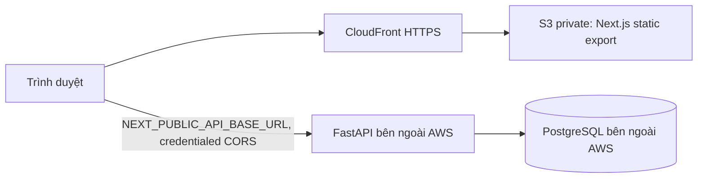

# AWS frontend CDN (FastAPI ở ngoài AWS)

Terraform này **chỉ** tạo S3/CloudFront/OAC và tài nguyên DNS/ACM tùy chọn cho frontend. Không tạo backend, database hay lưu thông tin Admin/AWS key. Next.js đã chuyển sang `output: "export"`: tất cả trang được xuất thành HTML tĩnh, các ID lấy từ query (`/exam?id=...`, `/admin/user?id=...`), dữ liệu runtime lấy trực tiếp từ FastAPI. CloudFront Function viết lại `/admin` thành `/admin.html` để refresh các route hoạt động; asset không tồn tại nhận 404, không bị chuyển về `index.html`.

Yêu cầu: Terraform >= 1.6, AWS CLI đã đăng nhập bằng profile/role, Node 22, npm. Dùng AWS profile, SSO hoặc CI identity; không ghi access key vào repo. Terraform mặc định dùng state cục bộ, cần lưu an toàn. Nếu dùng nhóm/CI, cấu hình remote S3 backend và Terraform S3 lockfile theo chính sách của bạn; không đặt credential trong `.tf`.

1. `cd devops/terraform && cp terraform.tfvars.example terraform.tfvars`, sửa `aws_region`, `environment`, tên project/domain theo nhu cầu. `terraform init && terraform plan && terraform apply`. Không cần domain riêng: CloudFront domain mặc định hoạt động qua HTTPS. Terraform outputs gồm bucket, distribution ID, frontend URL, hostname và ACM validation records.
2. Triển khai FastAPI/PostgreSQL độc lập. Cấu hình backend `FRONTEND_URL` bằng đúng output `frontend_url`; `APP_ENV=production`, JWT secret riêng. Nếu API và CDN khác site, dùng `COOKIE_SAMESITE=none` và HTTPS API. Xem [admin bootstrap và CORS](../docs/deployment.md).
3. Ở thư mục gốc repo: `NEXT_PUBLIC_API_BASE_URL=https://api.example.com ./devops/scripts/build-frontend.sh`. Giá trị là public **origin** của FastAPI, không thêm `/api/v1`. Build sẽ chạy `npm ci`, `npm run build` (Next.js dùng Webpack), kiểm tra `frontend/out/index.html`. URL này được đóng vào JavaScript; mỗi môi trường cần build riêng.
4. `./devops/scripts/deploy-frontend.sh` lấy bucket và distribution ID từ Terraform state, tải hashed `_next/static/*` với cache dài, HTML và các file khác với `no-cache`, rồi invalidation `/*`. Có thể chạy `./devops/scripts/invalidate-cloudfront.sh` riêng. **Các script không tự apply Terraform và không được chạy trong quá trình chuẩn bị code.**

Custom domain: đặt `enable_custom_domain=true`, `domain_name=app.example.com`. Để Terraform tự tạo ACM certificate ở `us-east-1`, cần DNS validation. Nếu `route53_zone_id` có giá trị, record validation được tạo tự động; đặt `create_route53_record=true` nếu muốn Terraform tạo cả alias A tới CloudFront. Nếu dùng DNS ngoài Route53, giữ `route53_zone_id=""`, `create_route53_record=false`: chạy `terraform apply -target=aws_acm_certificate.frontend`, đọc `terraform output -json acm_validation_records`, thêm CNAME được output vào DNS, chờ certificate `ISSUED`, rồi `terraform apply` đầy đủ. Có thể dùng `acm_certificate_arn` của certificate đã validated tại `us-east-1` để bỏ bước tạo certificate. Sau khi apply, tự trỏ CNAME/ALIAS domain về `cloudfront_domain_name`. Đặt `FRONTEND_URL` của backend thành custom origin đó và build lại nếu API URL đổi.

S3 frontend chặn mọi public access; chỉ CloudFront OAC với distribution ARN được đọc object. CloudFront redirect HTTP→HTTPS, nén phản hồi, cache tách HTML/asset, và đặt HSTS, nosniff, DENY framing, Referrer-Policy. `enable_cloudfront_logging=false` mặc định để tiết kiệm; bật nếu cần log S3 có vòng đời 30 ngày. `cloudfront_price_class=PriceClass_100` là mặc định tiết kiệm. Chưa có CSP vì ứng dụng và API ngoài domain cần đánh giá trước khi siết.

Nếu route trả 404, kiểm tra file tương ứng trong `frontend/out` và CloudFront Function; ví dụ `/admin/users` phải có `admin/users.html`. Nếu login lặp lại, kiểm tra `FRONTEND_URL`, `COOKIE_SAMESITE`, HTTPS API, browser third-party cookie policy và CORS credentials. Khi thay `NEXT_PUBLIC_API_BASE_URL`, phải build/deploy lại. Không dùng `INITIAL_ADMIN_*` trong frontend; xem [vòng đời secret](../docs/deployment.md).
